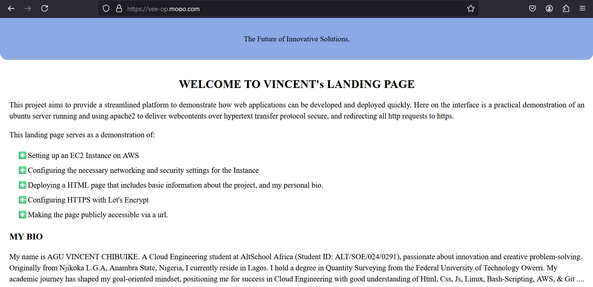

# **Provisioning an Ubuntu Server with a Landing page.**

You can view the live landing page here: 
[https://vee-op.mooo.com/](https://vee-op.mooo.com/)  
My Ip-address: [http://3.253.24.174/](http://3.253.24.174/)


## **Screenshot**


## **Description**
This project aims to provide a streamlined platform to demonstrate how web applications can be developed and deployed quickly. 
It is a practical demonstration of an ubuntu server running and using apache2 to deliver webcontents over hypertext transfer protocol secure, and redirecting all http requests to https.

## **Steps Followed**

###  1. **Setting up an EC2 Instance on AWS**
#### 1.1 Logged into my aws account and navigate to EC2
#### 1.2 Clicked on Launch Instance
#### 1.3 Inputed the name for my Instance
#### 1.4 Choose Ubuntu 20.04 LTS as the Amazon Machine Image
#### 1.5 Choose the system architecture 64-bit (x86)
#### 1.6 Selected an instance type such as t2.micro
#### 1.7 Created a key pair and downloaded the private key to my pc for SSH access
#### 1.8 Created a security group to allow HTTP (port 80), HTTPS (port 443) and SSH (port 22)
#### 1.9 Launch the instance.
#### 1.10 Took note of Public IP Address  

###  2. **SSH into Server & Installed Apache Web Server**
#### 2.1 Opened a command-line interfaces (CLIs) in my local computer. In this case `Git Bash`
#### 2.2 Naviagted to where I downloaded my private key and changed the file permissions for the private key I downloaded. 
`chmod 400 xxx.pem` 
#### 2.3 SSH into the server `ssh -i xxxx.pem ubuntu@ip-address`
#### 2.4 Updated the apt package manager and installed Apache:  
```bash
    sudo apt update ## to update apt package index.  
    sudo apt upgrade ## upgraded all updated applications
    sudo install apache2 ## installed Apache2 webserver  
```
Confirmed apache2 is up and running using `sudo systemctl status apache2`  
You should see the message active (running).
    
###  3. **Created a HTML File and sent a copy to my server**
#### 3.1 Launched Visual Studio Code, opened my project folder, and created an index.html file.
#### 3.2 Wrote my HTML code and integrated internal CSS for styling for my landing page.
#### 3.3 From my gitbash CLI, I Copied the index.html file to my server using secure copy via ssh  

            scp -i xxx.pem ~/project/index.html ubuntu@ipaddress:/home/ubuntu
        
#### 3.4 Moved the html file to /var/www/html which is the default folder in which apache renders from.
            sudo mv /home/ubuntu/index.html /var/www/html/

#### 3.5 Changed the index.html file's ownership to apache's user and group for full access to the file
            sudo chown www-data:www-data /var/www/html/index.html
#### 3.6 Confirmed that my page is up and running. By typing my ip-address in a browser. The page is displayed

###  4. **Firewall and Networking (Ensuring SSH, HTTP and HTTPS Traffic)**
#### 4.1  Setting my network and adding an extra layer of security to my server by ensuring that for http, https and ssh ports are open.
```bash
     sudo ufw allow 22      # SSH
     sudo ufw allow 80      # HTTP
     sudo ufw allow 443     # HTTPS
```
#### 4.2 Enable Firewall
     sudo ufw enable

###  5. **Registered a Domain, Configured HTTPS with Let’s Encrypt by Obtaining SSL certificate**
#### 5.1 Registered in a free domain platform [https://freedns.afraid.org/](https://freedns.afraid.org/)
#### 5.2 From their available free domain with the extension of `.mooo.com`, I added two subdomains for my website "vee-op.mooo.com" and "www.vee-op.mooo.com" so my website can be accessible from both the www and non-www version of my website name.
#### 5.3 Set `A Record` for the first and second subdomains and pointed both to my servers ip-address.
#### 5.4 Back in my server from the gitbash CLI, I added ServerName and ServerAllias to represent vee-op.mooo.com and www.vee-op.mooo.com in the default virtualhost confg file:
     sudo nano /etc/apache2/sites-available/000-default.conf
```apache
     <VirtualHost *:80>
        ServerAdmin webmaster@localhost
        ServerName vee-op.mooo.com
        ServerAlias www.vee-op.mooo.com
        DocumentRoot /var/www/html
    </VirtualHost>
```
#### 5.5 I enabled this new changes on the conf file by;
```bash 
    sudo a2ensite 000-default.conf     # to enable config file
    sudo apache2ctl configtest         # Test the config (it should return an "OK") 
    sudo systemctl restart apache2     # to restart apache2 webserver
```
#### 5.5 I installed certbot using;
    sudo apt install certbot python3-certbot-apache
#### 5.6 Run certbot and obtained free SSL certificates for my two domains. 
    sudo certbot --apache -d vee-op.mooo.com -d www.vee-op.mooo.com

###  6. **Redirects**
#### 6.1 Finally added redirects for the www.vee-op.mooo.com to redirect to vee-op.mooo.com. And to prevent security risks, I added redirects to the conf file for my server to redirect all http and ip-address requests to https of my domain.
```apache
    <VirtualHost *:80>
            # Enable the rewrite engine
            RewriteEngine on

            # Redirect requests for the server IP address to the domain
            RewriteCond %{HTTPS} off
            RewriteCond %{HTTP_HOST} ^3\.253\.24\.174$ [NC]
            RewriteRule ^ https://vee-op.mooo.com%{REQUEST_URI} [L,R=301]

            # Redirect requests for the domain (vee-op.mooo.com or www.vee-op.mooo.com) to HTTPS
            RewriteCond %{HTTPS} off
            RewriteCond %{HTTP_HOST} ^(www\.)?vee-op\.mooo\.com$ [NC]
            RewriteRule ^ https://vee-op.mooo.com%{REQUEST_URI} [L,R=301]
    </VirtualHost>